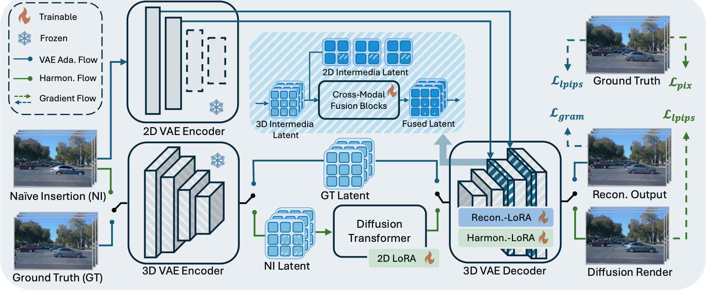

<div align="center">
<h3>Mirage: One-Step Video Diffusion for Photorealistic and Coherent Asset Editing in Driving Scenes</h3>

Shuyun Wang<sup>1</sup>,  Haiyang Sun<sup>2†</sup>,  Bing Wang<sup>2</sup>, Hangjun Ye<sup>2,✉</sup>, Xin Yu<sup>1,✉</sup>

<sup>1</sup>  The University of Queensland
<sup>2</sup>  Xiaomi EV 

(†) Project leader. (✉)Corresponding Author.

<a href=""></a>
<a href="https://github.com/wm-research/mirage"></a>
</div>


<!-- ## Introduction -->
## Abstract
Vision-centric autonomous driving systems rely on diverse and scalable training data to achieve robust performance. While video object editing offers a promising path for data augmentation, existing methods often struggle to maintain both high visual fidelity and temporal coherence. In this work, we propose Mirage, a one-step video diffusion model for photorealistic and coherent asset editing in driving scenes. Mirage builds upon a text-to-video diffusion prior to ensure temporal consistency across frames. However, 3D causal variational autoencoders often suffer from degraded spatial fidelity due to compression, and directly passing 3D encoder features to decoder layers breaks temporal causal013 ity. To address this, we inject temporally agnostic latents from a pretrained 2D encoder into the 3D decoder to restore detail while preserving causal structures. Furthermore, because scene objects and inserted assets are optimized under different objectives, their Gaussians exhibit a distribution mismatch that leads to pose misalignment. To mitigate this, we introduce a two-stage data alignment strategy combining coarse 3D alignment and fine 2D refinement, thereby improving alignment and providing cleaner 021
supervision. Extensive experiments demonstrate that Mirage achieves high realism and temporal consistency across diverse editing scenarios. Beyond asset editing, Mirage can also generalize to other video-to-video translation tasks, serving as a reliable baseline for future research.

## Overview
<div align="center">

</div>

## News
<!-- `[2025/12/31]` [ArXiv](https://arxiv.org/abs/2506.07497) paper release. Models/Code are coming soon. Please stay tuned! ☕️ -->

## Updates
- [x] Release Paper   
- [ ] Release Full Models  
- [ ] Release Inference Framework 
- [ ] Release Training Framework 


## Citation
If you find Mirage is useful in your research or applications, please consider giving us a star 🌟 and citing it by the following BibTeX entry.

```bibtex
@article{guo2025genesis,
  title={Mirage: One-Step Video Diffusion for Photorealistic and Coherent Asset Editing in Driving Scenes},
  author={Shuyun Wang, Haiyang Sun, Bing Wang, Hangjun Ye, Xin Yu},
  journal={},
  year={2025}
}
```
